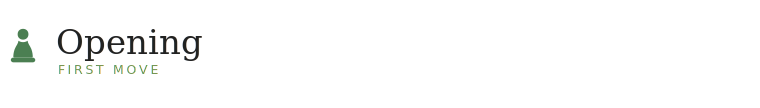

  <!-- Header Banner -->
  <picture>
    <source media="(prefers-color-scheme: dark)" srcset="assets/dark.svg">
    <source media="(prefers-color-scheme: light)" srcset="assets/light.svg">
    
  </picture>

    

  <!-- Opening Header -->
  

 

  <table width="100%" style="max-width: 700px;">
    <tr>
      <td align="center">
        Iftekhar Islam Tamim works from the back end forward — systems before screens, architecture before answers. Before a line of code exists, the shape of the system already does: how data moves, where it breaks, what happens under load. Python, Django, and FastAPI are the tools; distributed systems, networking, and system design are the interest. Competitive programming sharpened the habit of reading the whole board before the first move. Based in Dhaka, building things meant to hold.
      </td>
    </tr>
  </table>

---

  <!-- Tech Stack Header -->
  

 

  <table width="100%" style="max-width: 700px;">
    <tr>
      <td width="25%" valign="top"><b>Core</b></td>
      <td width="75%">Python · C++ · JavaScript · SQL</td>
    </tr>
    <tr>
      <td width="25%" valign="top"><b>Backend</b></td>
      <td width="75%">Django · Django REST Framework · FastAPI</td>
    </tr>
    <tr>
      <td width="25%" valign="top"><b>Frontend</b></td>
      <td width="75%">React · Flutter · Dart</td>
    </tr>
    <tr>
      <td width="25%" valign="top"><b>Database</b></td>
      <td width="75%">PostgreSQL</td>
    </tr>
    <tr>
      <td width="25%" valign="top"><b>Infrastructure</b></td>
      <td width="75%">Linux · Git · Docker</td>
    </tr>
    <tr>
      <td width="25%" valign="top"><b>Learning</b></td>
      <td width="75%">System Design · Cloud · Networking</td>
    </tr>
  </table>

---

  <!-- Featured Project Header -->
  

 

  <table width="100%" style="max-width: 700px;">
    <tr>
      <td>

### Description
GradBridge closes the gap between finishing a degree and starting a career — connecting graduates with the internships, entry-level roles, and mentors that get lost in the noise of a first job search.

### Architecture
A REST API backend, a relational data layer, and a React front end — deployed as a live web application and built to stay simple enough to extend.

### Highlights
Full-stack build from schema to shipped UI, designed and deployed solo, end to end.

### Status
Live — actively maintained.

### Future
Recommendation matching, richer graduate profiles, and a dashboard for partner institutions.

      </td>
    </tr>
  </table>

   

  

---

  <!-- Competitive Programming Header -->
  

 

  <table width="100%" style="max-width: 700px;">
    <tr>
      <td align="center" width="33%"><b>1240</b> Max Rating</td>
      <td align="center" width="33%"><b>Pupil</b> Current Rank</td>
      <td align="center" width="33%"><b>1500+</b> Problems Solved</td>
    </tr>
  </table>

   

  <table width="100%" style="max-width: 700px;">
    <tr>
      <td width="30" align="center"></td>
      <td>3rd Place — Intra University Junior Programming Contest</td>
    </tr>
    <tr>
      <td width="30" align="center"></td>
      <td>Runner-up — Intra University Programming Contest</td>
    </tr>
    <tr>
      <td width="30" align="center"></td>
      <td>ICPC Preliminary 2025 — Rank 450</td>
    </tr>
    <tr>
      <td width="30" align="center"></td>
      <td>Intra University CTF Competition — Rank 8</td>
    </tr>
  </table>

 

  
  

    

  

---

  

---

  <!-- Footer Header -->
  

    

  The board is always open for the next collaboration.

    

  <!-- Connect Links -->
  
  
  
  
  
  

